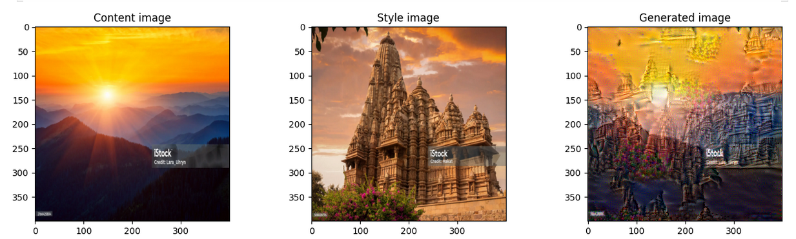

# Neural Style Transfer 
"Neural Style Transfer — Based on the Deep Learning Specialization (Coursera) Assignment"
Implemented a neural style transfer algorithm using pretrained convolutional neural networks (VGG-19) as part of Andrew Ng’s Deep Learning Specialization. Learned about content and style cost functions, and how to combine them to generate stylized images.

📌 What is Neural Style Transfer?

This project implements Neural Style Transfer, a technique that combines the content of one image with the style of another using a pretrained Convolutional Neural Network (VGG-19).
Neural Style Transfer uses deep learning to generate a new image that:
- Preserves the content of a base image (e.g., a photo)
- Adopts the style of a reference image (e.g., a painting)

It works by optimizing an image to minimize a content cost and a style cost, both computed using activations from a pretrained CNN.

🧠 What I Learned

- How convolutional networks can represent content and style separately
- How to compute content and style cost functions
- How to use a pretrained VGG-19 network for feature extraction
- Image optimization using gradient descent (not training a model!)

🛠️ Tools Used

    Python

    TensorFlow, Keras

    Pretrained VGG-19 network

    Jupyter Notebook

🖼️ Example Output

(Include screenshots or sample images if allowed.)

⚠️ Future Work

This is an educational implementation following the Coursera Deep Learning Specialization. For production or improve results, newer methods like Fast Style Transfer or StyleGAN-based models would give better result.
